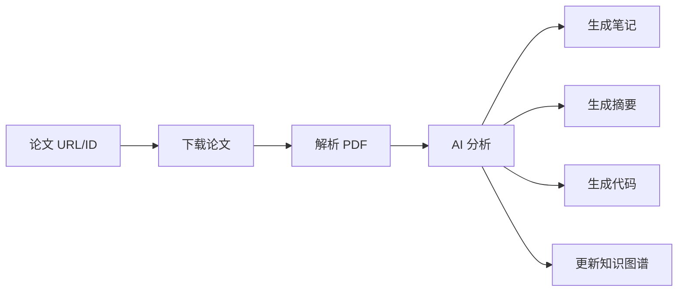

# 📚 Paper Reading Framework

<div align="center">


**使用 Moonshot AI (Kimi) 进行论文的精度阅读、内化和落地的完整框架**

[快速开始](#-快速开始) • [功能特性](#-功能特性) • [文档](#-文档) • [安装](#-安装) • [贡献](#-贡献)

</div>

---

## ✨ 功能特性

### 🎯 核心功能

- 📥 **智能论文获取** - 支持从 arXiv、SIGGRAPH 等平台自动下载论文
- 🤖 **AI 深度分析** - 使用 Moonshot AI (Kimi) 进行全面的论文分析
- 📖 **个性化阅读** - 根据读者背景提供定制化的教学引导和术语解释
- 📝 **知识内化** - 自动生成结构化笔记、摘要和知识图谱
- 💻 **代码生成** - 基于论文分析自动生成实现代码框架
- 🔍 **多维度分析** - 支持摘要、创新点、方法论、实现指南等多种分析类型

### 🌟 亮点

- ✅ **一键分析** - 从论文 URL 到完整分析结果，全流程自动化
- ✅ **智能适配** - 自动适配不同背景的读者（业余/专业）
- ✅ **完整工作流** - 下载 → 解析 → 分析 → 内化 → 代码生成，一气呵成
- ✅ **灵活使用** - 支持 Python API、命令行、AI IDE Skill 多种使用方式

## 🚀 快速开始

### 安装

```bash
# 从 PyPI 安装（推荐）
pip install paper-reading-framework

# 或从源码安装
git clone https://github.com/flashpoint493/paper-reading-framework.git
cd paper-reading-framework
pip install -e .
```

### 配置

1. 复制配置文件：
```bash
cp config.yaml.example config.yaml
```

2. 设置环境变量（推荐）：
```bash
# 在 .env 文件中设置
MOONSHOT_API_KEY=your-api-key-here
```

或在 `config.yaml` 中配置：
```yaml
moonshot:
  api_key: "your-moonshot-api-key"
  model: "moonshot-v1-32k"  # 推荐使用 32k 或 128k 处理长论文
```

### 使用示例

#### 方式 1: 使用 CLI 安装技能（推荐）

首先安装技能到你的 AI 助手：

```bash
# 安装到 Claude Code
paper-reading-init --ai claude

# 或安装到所有 AI 助手
paper-reading-init --ai all

# 查看所有支持的 AI 助手
paper-reading-init list
```

然后在 Claude Code 中直接使用技能：

```
Analyze paper 2301.12345 and generate implementation code
```

#### 方式 2: Python API

```python
from skills.paper_reading.scripts.paper_skill import PaperSkill

# 创建技能实例
skill = PaperSkill()

# 一键下载和分析
result = skill.download_and_analyze("2301.12345")  # arXiv ID

# 查看结果
print(f"笔记: {result['note_path']}")
print(f"代码: {result['code_dir']}")
print(f"摘要: {result['summary_path']}")
```

#### 方式 3: 命令行

```bash
# 完整流程（下载 + 分析 + 代码生成）
python .claude/skills/paper-reading/scripts/paper_skill.py 2301.12345 --action full

# 仅下载
python .claude/skills/paper-reading/scripts/paper_skill.py 2301.12345 --action download

# 仅分析
python .claude/skills/paper-reading/scripts/paper_skill.py 2301.12345 --action analyze --type summary

# 或使用主程序
python src/main.py download https://arxiv.org/abs/2301.12345
python src/main.py full papers/2301.12345/paper.pdf
```

#### 方式 4: 直接分析 arXiv URL

```bash
# 当 PDF 无法提取文本时，可直接使用 arXiv URL
python src/scripts/analyze_arxiv.py 2301.12345
```

## 📖 文档

- 📘 [CLAUDE.md](CLAUDE.md) - Claude Code 使用指南
- 📗 [SKILL.md](.claude/skills/paper-reading/SKILL.md) - 技能详细说明
- 📙 [快速开始指南](START_HERE.md) - 新手入门必读（如果存在）
- 📕 [Paper Skill 使用指南](skills/paper_reading/skill.md) - AI IDE 集成（如果存在）
- 📓 [API 配置指南](docs/api_setup.md) - Moonshot API 配置（如果存在）

## 🏗️ 项目结构

```
paper-reading-framework/
├── .claude/
│   └── skills/
│       └── paper-reading/      # Claude Code 技能
│           ├── SKILL.md         # 技能定义
│           └── scripts/
│               └── paper_skill.py  # 主入口脚本
├── src/                      # 核心源代码
│   ├── api/                  # Moonshot AI 客户端
│   ├── paper/                # 论文处理（下载、解析）
│   ├── knowledge/            # 知识内化（笔记、图谱）
│   ├── reading/              # 辅助阅读（术语、指南）
│   ├── implementation/       # 代码生成
│   └── scripts/              # 工具脚本
├── tests/                    # 测试脚本
├── scripts/                  # 发布脚本
├── docs/                     # 详细文档
├── skills/                   # Paper Skill 模块
├── CLAUDE.md                 # Claude Code 项目指导
├── .gitignore                # Git 忽略文件
└── config.yaml.example       # 配置模板
```

## 🎨 使用场景

### 学术研究
- 快速理解新论文的核心思想
- 提取关键技术和创新点
- 生成研究笔记和知识图谱

### 代码实现
- 基于论文自动生成代码框架
- 获取详细的实现指南
- 理解算法和技术细节

### 教学学习
- 根据背景提供个性化解释
- 术语自动解释和阅读指南
- 适合不同水平的读者

## 📊 工作流程



## 🔧 配置选项

### 模型选择

根据论文长度选择合适的模型：

```yaml
moonshot:
  model: "moonshot-v1-8k"    # 短论文（< 8K tokens）
  model: "moonshot-v1-32k"   # 中等论文（8K-32K tokens）
  model: "moonshot-v1-128k"  # 长论文（> 32K tokens）
```

### 读者配置

```yaml
reader_profile:
  type: "amateur"  # 或 "professional"
  background: "软件工程背景、高等数学基础"
  needs_guidance: true
```

## 📦 安装

### 系统要求

- Python 3.8+
- Moonshot AI API Key

### 依赖安装

```bash
pip install -r requirements.txt
```

主要依赖：
- `openai>=1.0.0` - Moonshot API 客户端
- `PyPDF2>=3.0.0` - PDF 解析
- `pyyaml>=6.0` - 配置文件
- `requests>=2.31.0` - HTTP 请求
- `python-dotenv>=1.0.0` - 环境变量管理
- `beautifulsoup4>=4.12.0` - HTML 解析
- `lxml>=4.9.0` - XML 解析

## 🤝 贡献

欢迎贡献！请查看 [贡献指南](CONTRIBUTING.md) 了解详细信息。

### 贡献方式

- 🐛 报告 Bug
- 💡 提出新功能
- 📝 改进文档
- 🔧 提交 Pull Request

## 📄 许可证

本项目采用 [MIT License](LICENSE) 许可证。

## 🔗 相关链接

- **GitHub**: [flashpoint493/paper-reading-framework](https://github.com/flashpoint493/paper-reading-framework)
- **PyPI**: [paper-reading-framework](https://pypi.org/project/paper-reading-framework/)
- **Moonshot AI**: [平台文档](https://platform.moonshot.cn/docs/guide/start-using-kimi-api)

## ⭐ 致谢

- [Moonshot AI](https://www.moonshot.cn/) - 提供强大的 AI 分析能力
- [arXiv](https://arxiv.org/) - 论文数据源

## 📮 联系方式

- **作者**: Ocarina
- **邮箱**: ocarina1024@gmail.com
- **GitHub**: [@flashpoint493](https://github.com/flashpoint493)

---

<div align="center">

**如果这个项目对您有帮助，请给个 ⭐ Star！**

Made with ❤️ by [Ocarina](https://github.com/flashpoint493)

</div>
